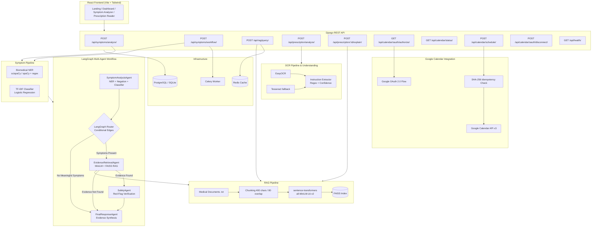
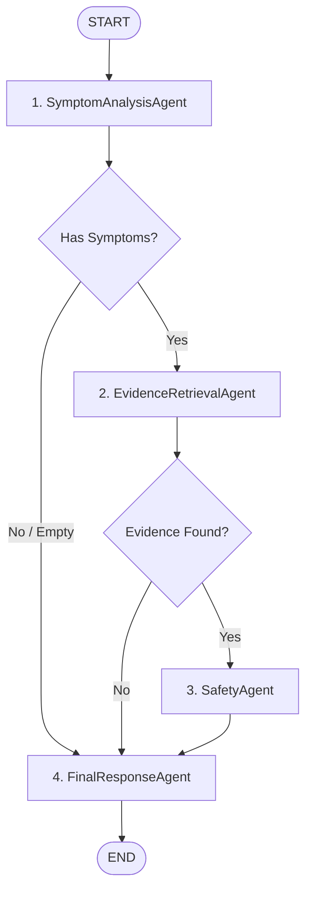

# 🏥 HealthIntel — AI-Powered Healthcare Information & Prescription Assistant

> **Educational / Health-Information Tool Only.**
> HealthIntel does not diagnose medical conditions, prescribe medicines, or replace professional medical advice.
> Always consult a qualified healthcare professional.

---

## Problem Statement

> *"Users often struggle to understand symptoms and information written on prescriptions. HealthIntel extracts useful information from symptoms and prescription images and provides an evidence-grounded health-information summary."*

---

## Project Summary

HealthIntel is a multi-agent AI healthcare information system built with React, Django, PostgreSQL, Docker, Hugging Face models, Whisper, OCR, and configurable LLM providers. It brings symptom analysis, prescription understanding, and evidence-grounded health information into one multimodal interface with text, voice, and guided form inputs.

### Resume-Ready Highlights

- Architected a multi-agent AI healthcare information system for symptom analysis, prescription understanding, evidence retrieval, and safety-oriented user guidance.
- Implemented a stateful **LangGraph** multi-agent workflow with conditional edges, dynamic evidence gating, and clinical negation isolation.
- Built NLP, biomedical NER, OCR, retrieval, and LLM pipelines for extracting structured medical information from symptom descriptions and prescription images.
- Developed confidence-aware prescription extraction that preserves source OCR, separates uncertain fields, and grounds extracted medicines in medical reference literature.
- Integrated **Google Calendar API** via server-side OAuth 2.0 with SHA-256 fingerprinting for idempotent, user-confirmed medication reminder scheduling without inventing reminder times.
- Delivered a responsive React + Vite interface with a Django REST backend, Redis caching, and containerized deployment architecture.

> **Safety scope:** HealthIntel is an educational tool and does not run a clinical drug-interaction or contraindication database. Safety Validation is therefore reported as unavailable rather than presented as a clinical conclusion.

### Proposed Solution Workflow

```text
Patient input (text symptom description or prescription image)
        ↓
AI-powered symptom checker / prescription understanding
        ↓
Multi-agent LangGraph orchestration / OCR & Medical Knowledge Retrieval
        ↓
Evidence-grounded recommendations & source citations
        ↓
Multimodal response with confidence, limitations, and Google Calendar reminders
```

### Intended Impact

- **Accuracy:** Separates extraction from explanation and exposes confidence so uncertain information can be verified.
- **Clarity:** Converts symptom descriptions and prescription images into structured, readable information.
- **Accessibility:** Supports transparent confidence indicators and intuitive medication reminder scheduling.
- **Efficiency:** Reduces repetitive information-gathering work for healthcare professionals and patients.
- **Scale:** Uses modular APIs, retrieval, caching, and Docker-based services to support future deployment growth.

---

## Features

| Feature | Technology | Status |
|---|---|---|
| Symptom input (natural language) | React + Tailwind | ✅ |
| Biomedical NER | scispaCy / spaCy + regex | ✅ |
| Negation handling | Rule-based syntactic boundary isolation | ✅ |
| Symptom classifier | TF-IDF + Logistic Regression (6 categories) | ✅ |
| Medical knowledge base | Curated reference documents | ✅ |
| RAG retrieval | FAISS + sentence-transformers (all-MiniLM-L6-v2) | ✅ |
| Agentic AI workflow | LangGraph (4-node StateGraph with conditional routing) | ✅ |
| LLM integration | Gemini API / OpenAI (configurable with offline fallback) | ✅ |
| Prescription OCR | EasyOCR + Tesseract fallback | ✅ |
| Prescription Understanding & Evidence | Semantic RAG + Medical Knowledge Base | ✅ |
| Medication Reminders | Google Calendar API + OAuth 2.0 (Idempotent) | ✅ |
| Async processing | Redis + Celery | ✅ |
| REST API | Django REST Framework + JWT | ✅ |
| Database | PostgreSQL / SQLite | ✅ |
| Caching | Redis | ✅ |
| Docker | Docker Compose (5 services) | ✅ |
| CI/CD | GitHub Actions | ✅ |
| Tests | pytest + pytest-django (53 tests passed) | ✅ |
| Evaluation | Cross-validation, Precision@K | ✅ |

---

## Architecture



---

## AI/ML Pipeline

### 1. Biomedical NER (`ml/ner_pipeline.py`)
- Primary: **scispaCy** `en_core_sci_sm` — biomedical entity recognition
- Fallback 1: **spaCy** `en_core_web_sm`
- Fallback 2: **keyword + regex** matching with strict negation boundary detection
- Extracts: positive symptoms, denied/negated symptoms, duration, severity, body area
- Negation handling: separates active symptoms from denied symptoms (e.g., "no chest pain" prevents false warnings)

### 2. Symptom Classifier (`ml/classifier.py`)
- **TF-IDF** (1-2 grams, 5000 features, sublinear TF) + **Logistic Regression**
- 6 categories: Respiratory, Digestive, Neurological, Dermatological, Musculoskeletal, General
- 90 curated training samples (15 per class)
- Evaluates **only positive, non-negated symptoms**
- Returns category + confidence + all class probabilities
- Saved as `ml/models_store/tfidf_classifier.pkl`

### 3. RAG Pipeline (`ml/rag_engine.py`)
- Embeddings: **sentence-transformers** `all-MiniLM-L6-v2` (384-dim, CPU-only)
- Vector DB: **FAISS** `IndexFlatIP` with L2-normalized cosine similarity
- Chunk size: 400 chars, overlap: 80 chars
- Ingestion: `python manage.py ingest_documents`
- Similarity threshold: 0.35 minimum retrieval similarity to avoid irrelevant matches
- **Redis caching**: 1-hour TTL per query hash

### 4. LangGraph Multi-Agent Workflow (`ml/agent_workflow.py`)

A stateful, genuinely multi-agent **LangGraph-based health-information workflow** (not an AI diagnostic system) orchestrated via conditional edges:



#### Shared Typed State (`AgentState`)
Shared state flows through all agents containing:
- `user_input`: raw query text
- `extracted_symptoms`: active positive symptoms
- `denied_symptoms`: explicitly denied/negated symptoms (isolated from warnings)
- `duration`, `severity`, `body_area`: clinical context
- `classification`, `classification_probabilities`: preliminary health category
- `evidence`, `evidence_found`, `sources`: retrieved literature
- `safety_status` (`SAFE` | `WARNING` | `NEEDS_REVIEW`), `safety_flags`, `is_urgent`
- `response`, `limitations`, `workflow_status`: final guidance and execution trail
- `agent_steps`: chronological trace with statuses (`completed`, `warning`, `skipped`, `no_evidence`)

#### The Four Specialized Agents

| Agent | Responsibilities & Behavior |
|---|---|
| **1. SymptomAnalysisAgent** | Biomedical NER, negation detection, duration/severity parsing, and TF-IDF category classification. Writes structured information into shared state. **Does NOT diagnose diseases.** |
| **2. EvidenceRetrievalAgent** | Builds focused semantic query from positive symptoms, embeds via MiniLM, searches FAISS, deduplicates passages, evaluates against 0.35 similarity threshold, sets `evidence_found`. Never fabricates evidence. |
| **3. SafetyAgent** | Inspects active symptoms (denied symptoms strictly excluded) for acute red-flag patterns. Sets `safety_status` (`SAFE` / `WARNING`) and emergency flags. Does NOT invent drug interactions or claim clinical safety. |
| **4. FinalResponseAgent** | Synthesizes evidence-grounded educational health guidance. Dynamically adapts: clarification if input is empty, explicit limitation notice if evidence is absent, emergency advisory if red flags exist, or full referenced literature report. |

#### Real LangGraph Conditional Routing
1. **After SymptomAnalysisAgent**: If no meaningful symptoms extracted → routes directly to `FinalResponseAgent` with clarification state (bypassing retrieval and safety).
2. **After EvidenceRetrievalAgent**: If `evidence_found == False` → routes directly to `FinalResponseAgent` with limited-evidence state (bypassing safety check).
3. **After SafetyAgent**: Passes structured `safety_status` to `FinalResponseAgent` to format appropriate caution or emergency advisory.
4. **Skipped Tracking**: Bypassed agents are recorded with `status: 'skipped'` in `agent_steps` so the UI and API consumers have complete visibility.

#### Response Generation Engine
- **Configurable LLM**: Gemini API or OpenAI with single-attempt fail-fast circuit breaker.
- **Evidence-Grounded Fallback**: Complete deterministic synthesizer that operates with zero API keys or during offline conditions.

### 5. Prescription OCR Pipeline (`ml/ocr_pipeline.py`)
> *The prescription pipeline remains a separate OCR pipeline and is intentionally not an LLM agent.*
- Primary: **EasyOCR** (GPU=False, English)
- Fallback: **Tesseract** (pytesseract)
- Extracts: medicine name, dosage, frequency, duration via regex
- Evidence explanation: queries medication clinical guide in FAISS for verified pharmacological information (`POST /api/prescription/<id>/explain/`)
- Low-confidence fields display: *"Unable to confidently read this field. Please verify with a pharmacist or doctor."*

### 6. Medication Reminders & Google Calendar Integration (`apps/calendar/`)
- **OAuth 2.0 Flow**: Implements server-side Google OAuth 2.0 (`/api/calendar/oauth/authorize/` and `/callback/`) requesting minimal calendar scopes (`https://www.googleapis.com/auth/calendar.events`).
- **Token Security**: Tokens are stored server-side encrypted with Django cryptographic signing (`django.core.signing`). Disconnecting (`POST /api/calendar/oauth/disconnect/`) deletes stored credentials without altering created calendar events.
- **User-Confirmed Scheduling**: Never invents or assumes times. For instructions like *"at night"* or *"twice daily"*, the user explicitly selects their preferred reminder time via UI time pickers.
- **SHA-256 Idempotency**: Prevents duplicate calendar events by computing a hash fingerprint (`user_id | medicine_id | start_time | timezone | frequency`). Duplicate submissions return the existing event ID without re-inserting.
- **Recurrence Rules (RRULE)**: Automatically attaches RFC 5545 recurrence rules (e.g., `RRULE:FREQ=DAILY;COUNT=5`) matching the extracted medication duration.
- *Note*: Operates in standard Google OAuth development / testing mode with user consent for local environments.

---

## Database Design

```
User ─────────────── SymptomAnalysis ── ExtractedSymptom
  │                       │
  │                       ├── AnalysisSource
  │                       └── WorkflowRun
  │
  ├───────────────── Prescription ── Medicine
  │
  ├───────────────── GoogleCalendarCredential
  │
  └───────────────── MedicationCalendarEvent (Unique: user + fingerprint)
```

---

## API Documentation

| Method | Endpoint | Auth | Description |
|---|---|---|---|
| POST | `/api/auth/register/` | No | Create user account |
| POST | `/api/auth/login/` | No | Obtain JWT token pair |
| POST | `/api/auth/refresh/` | No | Refresh access token |
| GET | `/api/auth/profile/` | JWT | Retrieve current user profile |
| GET | `/api/health/` | No | Service health and component status check |
| GET | `/api/history/` | JWT | Retrieve historical symptom analyses |
| POST | `/api/symptoms/analyze/` | JWT | Direct NER + TF-IDF category classifier |
| POST | `/api/symptoms/workflow/` | JWT | Execute LangGraph 4-agent stateful workflow |
| GET | `/api/agents/workflow/<id>/status/` | JWT | Check status of async/sync workflow run |
| POST | `/api/rag/query/` | JWT | Semantic medical literature search |
| POST | `/api/prescription/analyze/` | JWT | OCR extraction of medication instructions |
| POST | `/api/prescription/<id>/explain/` | JWT | Clinical evidence retrieval for extracted prescription |
| GET | `/api/calendar/status/` | JWT | Google Calendar connection status & scheduled IDs |
| GET | `/api/calendar/oauth/authorize/` | JWT | Generate Google OAuth 2.0 authorization URL |
| GET | `/api/calendar/oauth/callback/` | No/OAuth | Process Google OAuth code and persist credentials |
| POST | `/api/calendar/oauth/disconnect/` | JWT | Delete saved Google Calendar credentials |
| POST | `/api/calendar/schedule/` | JWT | Create idempotent recurring medication calendar event |

---

## Evaluation Methodology & Verified Results

### Symptom Classifier
- **Method**: 5-fold stratified cross-validation on 90 hand-labelled clinical symptom samples
- **Script**: `python backend/evaluation/evaluate_classifier.py`
- **Verified Results**:
  - Accuracy: **71.11%** (± 8.16%)
  - Macro F1: **70.01%** (± 7.11%)
  - Macro Precision: **77.06%** (± 6.43%)
  - Macro Recall: **71.11%** (± 8.16%)

### RAG Retrieval
- **Method**: 8 curated clinical query-relevance test cases evaluating MiniLM embeddings + FAISS cosine similarity
- **Script**: `python backend/evaluation/evaluate_rag.py`
- **Verified Results**:
  - Precision@1: **1.000** | Recall@1: **0.625**
  - Precision@3: **0.708** | Recall@3: **0.700**
  - Precision@5: **0.525** | Recall@5: **0.725**

> Detailed evaluation reports and logs are recorded in [backend/evaluation/results.md](backend/evaluation/results.md).

---

## Docker Setup

### Prerequisites
- Docker Desktop (or Docker Engine + Compose)
- A `.env` file (copy from `.env.example`)

```bash
# 1. Clone and enter project
git clone <repo-url>
cd HealthIntel

# 2. Configure environment
cp .env.example .env
# Edit .env — add GEMINI_API_KEY at minimum

# 3. Start everything
docker compose up --build

# Services:
#   Frontend:  http://localhost:3000
#   Backend:   http://localhost:8000
#   API docs:  http://localhost:8000/api/health/
```

### Individual commands
```bash
# Run migrations only
docker compose exec backend python manage.py migrate

# Ingest medical documents into FAISS
docker compose exec backend python manage.py ingest_documents

# Run backend tests
docker compose exec backend pytest tests/ -v

# Run classifier evaluation
docker compose exec backend python evaluation/evaluate_classifier.py

# Run RAG evaluation
docker compose exec backend python evaluation/evaluate_rag.py

# Access Django shell
docker compose exec backend python manage.py shell
```

---

## Local Development (without Docker)

> Python must be in PATH. Requires PostgreSQL and Redis running locally.

```bash
# Backend
cd backend
pip install -r requirements.txt
python -m spacy download en_core_web_sm
cp ../.env.example ../.env   # edit DATABASE_URL, REDIS_URL
python manage.py migrate
python manage.py ingest_documents
python manage.py runserver

# Celery worker (separate terminal)
celery -A config worker --loglevel=info

# Frontend (separate terminal)
cd frontend
npm install
npm run dev
# → http://localhost:5173
```

---

## Environment Variables

| Variable | Required | Description |
|---|---|---|
| `SECRET_KEY` | Yes | Django secret key |
| `DATABASE_URL` | Yes | PostgreSQL connection string |
| `REDIS_URL` | Yes | Redis connection string |
| `GEMINI_API_KEY` | Recommended | For LangGraph LLM agents |
| `OPENAI_API_KEY` | Optional | OpenAI alternative |
| `LLM_PROVIDER` | Optional | `gemini` (default) or `openai` |
| `GEMINI_MODEL` | Optional | Default: `gemini-1.5-flash` |
| `ENABLE_TRANSFORMER_CLASSIFIER` | Optional | `true` to enable DistilBERT |
| `GOOGLE_OAUTH_CLIENT_ID` | Optional | Google OAuth 2.0 Web Client ID |
| `GOOGLE_OAUTH_CLIENT_SECRET` | Optional | Google OAuth 2.0 Client Secret |
| `GOOGLE_OAUTH_REDIRECT_URI` | Optional | Server callback endpoint (`http://localhost:8000/api/calendar/oauth/callback/`) |
| `GOOGLE_CALENDAR_FRONTEND_REDIRECT_URL` | Optional | Frontend return URL (`http://localhost:5173/prescriptions`) |
| `DEBUG` | Optional | Default: `False` |

---

## Implemented Technologies (Verified)

- ✅ **Python** — backend + ML
- ✅ **Django + DRF** — REST API, JWT auth, admin
- ✅ **PostgreSQL** — primary database
- ✅ **scikit-learn** — TF-IDF, Logistic Regression, cross-validation
- ✅ **spaCy** — NER pipeline
- ✅ **Hugging Face sentence-transformers** — MiniLM embeddings
- ✅ **FAISS** — vector similarity search
- ✅ **LangGraph** — 4-agent StateGraph workflow
- ✅ **Gemini API / LangChain** — LLM integration
- ✅ **EasyOCR** — primary OCR
- ✅ **Tesseract** — OCR fallback
- ✅ **Redis** — caching + Celery broker
- ✅ **Celery** — async task queue
- ✅ **React + Vite** — frontend framework
- ✅ **Tailwind CSS** — styling
- ✅ **Docker + Docker Compose** — containerisation
- ✅ **GitHub Actions** — CI/CD pipeline
- ✅ **Google Calendar API** — Converts user-confirmed prescription schedules into time-bound medication reminder events.

---

## Limitations

1. **Training data size**: The TF-IDF classifier uses 90 hand-crafted examples. Real-world performance would require thousands of labelled samples.
2. **Medical knowledge base**: 4 curated text documents. A production system would use structured medical ontologies (UMLS, SNOMED CT).
3. **OCR accuracy**: EasyOCR performs best on clear, well-lit images. Handwritten or faded prescriptions may have low confidence.
4. **No GPU required**: All ML components run on CPU; this makes deployment easy but DistilBERT inference is slower.
5. **LLM dependency**: Without a valid `GEMINI_API_KEY`, agents fall back to rule-based text generation.

---

## Future Improvements

- [ ] Larger symptom classification dataset (use MIMIC-III or public health NLP datasets)
- [ ] Fine-tuned DistilBERT/BioBERT classifier
- [ ] scispaCy `en_core_sci_lg` for higher NER accuracy
- [ ] Structured medical KB (UMLS or MedlinePlus API)
- [ ] Streaming LangGraph workflow updates via WebSocket
- [ ] User history analytics dashboard
- [ ] PDF prescription support
- [ ] Multilingual OCR support

---

## ⚠️ Medical Disclaimer

**HealthIntel is an educational health-information tool only.**

It does not provide medical advice, diagnoses, or prescriptions. All information displayed is for
general educational purposes. The AI-generated content may be inaccurate and must never be used
as a substitute for professional medical advice from a licensed healthcare provider.

In a medical emergency, call your local emergency number immediately.

---

*Built as a portfolio project demonstrating production-quality AI/ML engineering.*
